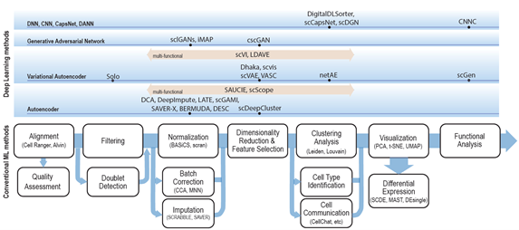

# Introduction {#ch-1}

Single cell sequencing technology has been a rapidly developing area to study genomics, transcriptomics, proteomics, metabolomics, and cellular interactions at the single cell level for cell-type identification, tissue composition and reprogramming [@RN87; @RN98]. Specifically, sequencing of the transcriptome of single cells, or single-cell RNA-sequencing (scRNA-seq), has become the dominant technology in many frontier research areas such as disease progression and drug discovery [@RN101; @RN78; @RN85]. One particular area where scRNA-seq has made a tangible impact is cancer, where scRNA-seq is becoming a powerful tool for understanding invasion, intratumor heterogeneity, metastasis, epigenetic alterations, detecting rare cancer stem cells, and assessing therapeutic response . Currently, scRNA-seq is applied to develop personalized therapeutic strategies that are potentially useful in cancer diagnosis, therapy resistance during cancer progression, and the survival of patients [@RN59;@RN91]. The scRNA-seq has also been adopted to combat COVID-19 to elucidate how the innate and adaptive host immune system miscommunicates resulting in worsening immunopathology produced during this viral infection [@RN99]. 

These studies have led to a massive amount of scRNA-seq data deposited to public databases such as Single Cell PORTAL, Single Cell Expression Atlas, PanglaoDB, and scRNASeqDB. Expressions of millions of cells from 18 species have been collected and deposited, waiting for further analysis. On the other hand, due to biological and technical factors, scRNA-seq data presents several analytical challenges related to its complex characteristics like missing expression values, high technical and biological variance, noise and sparse gene coverage, and elusive cell identities [@RN87]. These characteristics make it difficult to directly apply commonly used bulk RNA-seq data analysis techniques and have called for novel statistical approaches for scRNA-seq data cleaning and computational algorithms for data analysis and interpretation. To this end, specialized scRNA-seq analysis pipelines such as Seurat [9] and Scanpy [10], along with a large collection of task-specific tools, have been developed to address the intricate technical and biological complexity of scRNA-seq data. 

Recently, deep learning has demonstrated its significant advantages in natural language processing and speech and facial recognition with massive data. Such advantages have initiated the application of DL in scRNA-seq data analysis as a competitive alternative to conventional machine learning approaches for uncovering cell clustering [11, 12], cell type identification [11, 13], gene imputation [14-16],  and batch correction [17] in scRNA-seq analysis. Compared to conventional machine learning (ML) approaches, DL is more powerful in capturing complex features of high-dimensional scRNA-seq data. It is also more versatile, where a single model can be trained to address multiple tasks or adapted and transferred to different tasks. Moreover, the DL training scales more favorably with the number of cells in scRNA-seq data size, making it particularly attractive for handling the ever-increasing volume of single cell data.  Indeed, the growing body of DL-based tools has demonstrated DL’s exciting potential as a learning paradigm to significantly advance the tools we use to interrogate scRNA-seq data.  

In this paper, we present a comprehensive review of the recent advances of DL methods for solving the present challenges in scRNA-seq data analysis (Table 1) from the quality control, normalization/batch effect reduction, dimension reduction, visualization, feature selection, and data interpretation by surveying deep learning papers published up to April 2021. In order to maintain high quality for this review, we choose not to include any (bio)archival papers, although a proportion of these manuscripts contain important new findings that would be published after completing their peer-reviewed process. Previous efforts to review the recent advances in machine learning methods focused on efficient integration of single cell data [18, 19]. A recent review of DL applications on single cell data has summarized 21 DL algorithms that might be deployed in single cell studies [20]. It also evaluated the clustering and data correction effect of these DL algorithms using 11 datasets. 

In this review, we focus more on the DL algorithms with a much detailed explanation and comparison. Further, to better understand the relationship of each surveyed DL model with the overall scRNA-seq analysis pipeline, we organize the surveys according to the challenge they address and discuss these DL models following the analysis pipeline. A unified mathematical description of the surveyed DL models is presented and the specific model features are discussed when reviewing each method. This will also shed light on the modeling connections among the surveyed DL methods and the recognization of the uniqueness of each model. Besides the models, we also summarize the evaluation matrics of these DL algorithms and compare the tools that integrate these DL algorithms. Access to these DL algorithms with the original research results, available datasets used by these methods are also listed to demonstrate the advantages and utility of the DL algorithms. We envision that this survey will serve as an important information portal for learning the application of DL for scRNA-seq analysis and inspire innovative use of DL to address a broader range of new challenges in emerging multi-omics and spatial single-cell sequencing. 


<!-- Sample cross-reference to chapter \@ref(abstract)  -->
<!-- <!-- ?? chapter label cross-ref??? --> -->

<!-- This is sample figure and labeling: This is Fig.\@ref(fig:Figure1) -->

<!-- ```{r Figure1, fig.cap = "Conventional single cell data analysis steps. Depending on the input data and analysis objectives, major analysis steps are illustrated in the middle track, along with optional analysis modules below each analysis module. Deep learning algorithms, either specific task"} -->
<!-- # -->
<!-- ``` -->

<!-- Reference Test, Reference 1 [@boscke2011ferroelectricity] -->

<!-- You can write citations, too. For example, we are using the **bookdown** package [@R-bookdown] in this sample book, which was built on top of R Markdown and **knitr** [@xie2015]. -->


<!-- Small caps can be produced by the HTML tag span, e.g., <span style="font-variant:small-caps;">Small Caps</span> -->


<!-- Links are created using [text](link) e.g., [RStudio](https://www.rstudio.com) -->


<!-- the syntax for images is similar: just add an exclamation mark, e.g.,  -->


<!-- Footnotes are put inside the square brackets after a caret ^[], e.g., ^[This is a footnote.]. -->


<!-- Section headers can be written after a number of pound signs, e.g., -->

<!-- # First-level header -->

<!-- ## Second-level header -->

<!-- ### Third-level header -->


<!-- If you do not want a certain heading to be numbered, you can add {-} after the heading, e.g., -->
<!-- # Preface {-} -->


<!-- Unordered list items start with *, -, or +, and you can nest one list within another list by indenting the sub-list by four spaces, e.g., -->

<!-- - one item -->
<!-- - one item -->
<!-- - one item -->
<!--     - one item -->
<!--     - one item -->

<!-- Ordered list items start with numbers (the rule for nested lists is the same as above), e.g., -->

<!-- 1. the first item -->
<!-- 2. the second item -->
<!-- 3. the third item -->


<!-- Blockquotes are written after >, e.g., -->


<!-- > "I thoroughly disapprove of duels. If a man should challenge me, -->
<!--   I would take him kindly and forgivingly by the hand and lead him -->
<!--   to a quiet place and kill him." -->
<!-- > -->
<!-- > --- Mark Twain -->


<!-- Plain code blocks can be written after three or more backticks, and you can also indent the blocks by four spaces, e.g., -->


<!-- ``` -->
<!-- This text is displayed verbatim / preformatted -->
<!-- ``` -->

<!-- Or indent by four spaces: -->

<!--     This text is displayed verbatim / preformatted -->


