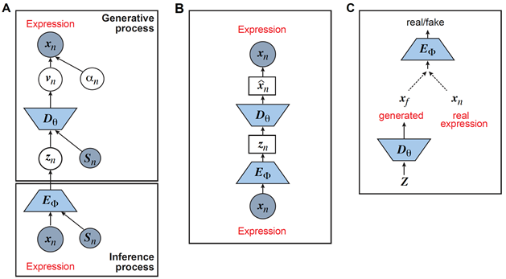

# Overview of common deep learning models for scRNA-seq analysis {#ch-3}


```{r Figure2, fig.cap = "Graphical models of the surveyed DL models including A) Variational Autoencoder (VAE); B) Autoencoder (AE); and C) Generative Adversarial Network (GAN)"}

```


Unsupervised learning is the key step in the scRNA-Seq analysis, including batch correction, dimension reduction, imputation, and clustering, which lend themselves naturally to unsupervised DL models including the variational autoencoder (VAE), the autoencoder (AE), or generative adversarial networks (GAN). Also, adversarial transfer learning has been applied for cell-type classification. We started our review by introducing the general formulations of VAE, AE, and GAN for scRNA-seq together with their training strategies. These general formulations facilitate understanding the methodologies used by different papers in developing their specific algorithms, enabling us to focus on the different features of each method and bring attention to their uniqueness and novelty.  

